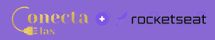
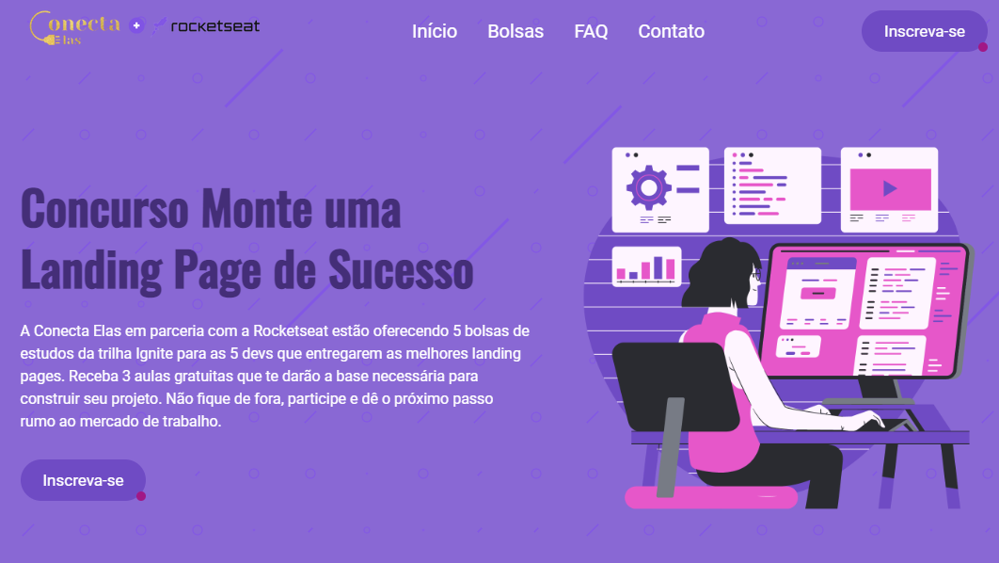
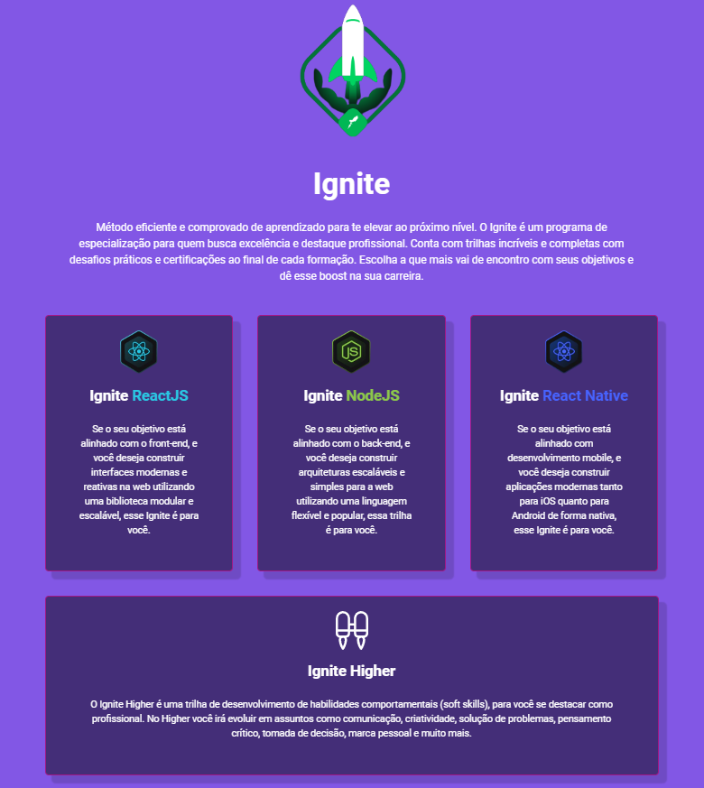
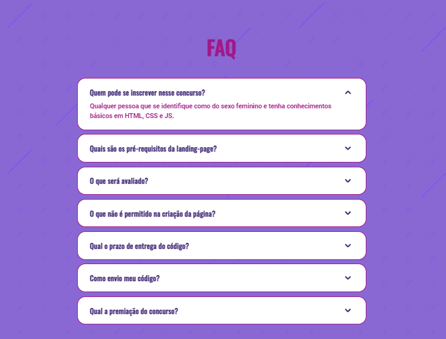
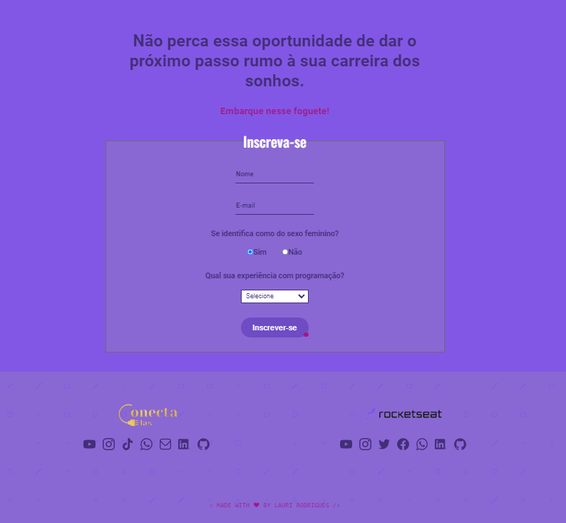

  

	
<h4 align="center"> 
	🚀 Concurso "Monte uma Landing Page de Sucesso"
</h4>

  

  
  
  
  
  <a href="https://laurirodrigues.github.io/Landing-Page-Concurso/"> ▶️ Visualizar Deploy </a>

<h2 align=left> 💻 Sobre o projeto </h3>

 Landing page feita para o concurso <strong>"Monte uma Landing Page de Sucesso"</strong> realizado pela Conecta Elas em parceria com a <a href="https://www.rocketseat.com.br/"> <strong>Rocketseat</strong> </a> onde os melhores projetos concorriam a bolsas de 100% do curso Ignite.

  
<h2 align=left> 🛠 Tecnologias utilizadas </h3>

  
  
  

<h2 align=left> 🎨 Layout </h2>

<h4>💻 Desktop </h4>

